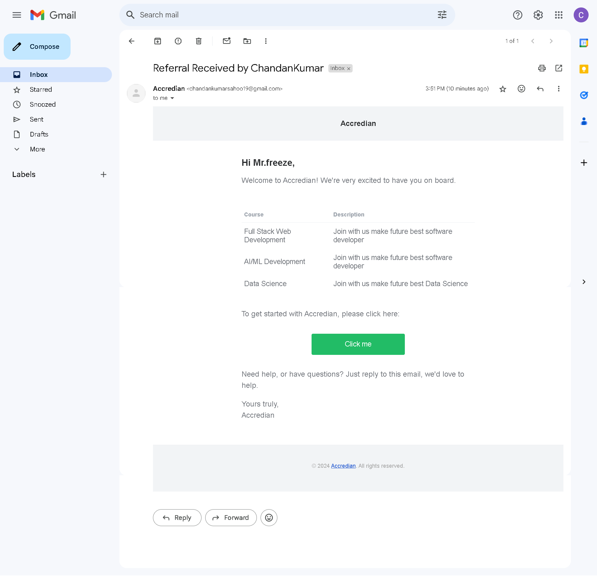
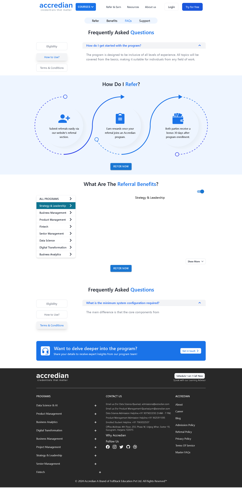

## 🌟 Refer & Earn Frontend

Welcome to the frontend of the Refer & Earn application! This user-friendly interface allows users to easily refer others and earn rewards.

## 🎨 Technologies Used

- **React** - JavaScript library for building user interfaces
- **JavaScript** - Programming language
- **Vite** - Build tool
- **Material-UI (MUI)** - UI components
- **Flowbite** - UI components
- **Tailwind CSS** - Utility-first CSS framework
- **React Router DOM** - For routing


## 📦 Setup Instructions

## Prerequisites

- Node.js (version >= 14)
- NPM or Yarn package manager

## Getting Started


1. **Clone the repository**
    ```bash
    git clone https://github.com/Chandan8018/AccredianFrontend.git ↩
    cd AccredianFrontend ↩
    ```

2. **Backend Setup**:
    ```bash
    npm install ↩
    ``` 

3. **Start the server**:
    ```bash
    npm run dev ↩
    ``` 

## Folder Structure

```sh
.
├── src
│   ├── components
│   ├── pages
│   ├── styles
│   ├── data
│   ├── spinner
│   ├── App.jsx
│   ├── index.css
│   └── main.jsx
├── public
├── index.html
├── README.md
├── .env
├── package.json
└── vite.config.js
```
## Demo
- Home Page

---
- Refer Notifiction Mail Page

---
- Refer Page

---
- Dynamic Home Page

---

## Contact
For any questions or inquiries, please contact:

- Author: Chandan Kumar Sahoo
- Email: chandankumarsahoo19@gmail.com
- GitHub: https://github.com/Chandan8018/

### Notes:

1. **Repository URL**: Make sure to update the repository URL (`https://github.com/Chandan8018/AccredianFrontend.git`) with the actual URL of your frontend repository.
2. **Environment Variables**: If there are specific environment variables required for the frontend (e.g., API base URL), mention them in the README.
3. **Consistency**: Ensure the names and paths of images in the `public` directory match those in the README.

Feel free to adjust any details to better fit your project’s specific setup and requirements.
